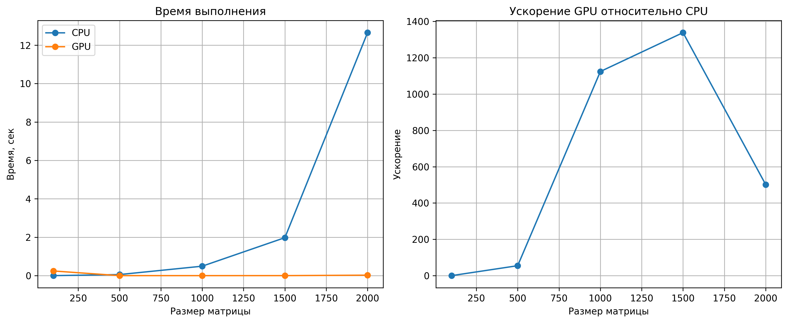

# Лабораторная работа 1. Перемножение матриц

## Цель работы

Цель работы — реализовать умножение квадратных матриц на CPU и на GPU с использованием CUDA, сравнить время выполнения двух реализаций, проверить корректность результатов и оценить ускорение GPU относительно CPU.

## Описание выполненной работы

В ходе лабораторной работы было реализовано умножение квадратных матриц двумя способами:
- на CPU с помощью классического алгоритма с тремя вложенными циклами;
- на GPU с использованием CUDA через библиотеку PyTorch.

В работе были проведены эксперименты на матрицах разных размеров, измерено время выполнения для каждой реализации, выполнена проверка корректности результатов и рассчитано ускорение GPU относительно CPU.

Основной файл проекта — `matmul.ipynb`.  
В нём содержатся исходный код, пояснения, таблица результатов, графики и вывод.

## Результаты эксперимента

| Размер | CPU, сек | GPU, сек | Ускорение | Корректность |
|---|---:|---:|---:|---|
| 100 | 0.000876 | 0.026244 | 0.03 | True |
| 500 | 0.057032 | 0.000782 | 72.94 | True |
| 1000 | 0.519009 | 0.000453 | 1145.23 | True |
| 1500 | 2.110887 | 0.000928 | 2275.31 | True |
| 2000 | 13.961655 | 0.159832 | 87.35 | True |

## Графики

## Вывод

В ходе лабораторной работы были реализованы  две версии умножения квадратных матриц:  
1)Последовательная версия на CPU  
2)Версия на GPU с использованием CUDA  через библиотеку PyTorch.

Проведённые эксперименты показали,  что для всех протестированных размеров матриц  результаты вычислений совпадают.  Это подтверждает корректность реализации.
Сравнение времени выполнения показало,  что для небольшой матрицы `100×100`  использование GPU оказалось невыгодным. Это связано с тем, что накладные расходы  на запуск вычислений и передачу данных  превышают выигрыш от параллельной обработки.

При увеличении размера матриц  преимущество GPU становится заметнее.  Начиная с размера `500×500`,  графический процессор начинает  существенно опережать CPU.
Наибольшее ускорение в данном эксперименте  было получено для матрицы `1500×1500`  и составило `2275.31` раза.Для матрицы `2000×2000`  GPU также сохранил преимущество, 
однако ускорение уменьшилось.  Это может быть связано  с увеличением нагрузки на память   и особенностями выполнения вычислений  на большом объёме данных.

Таким образом, полученные результаты показывают,  что использование GPU особенно эффективно  для средних и больших размеров матриц,  тогда как для небольших матриц  
более рационально использовать CPU.

## Содержимое проекта

- `matmul.ipynb` — основной ноутбук с кодом, пояснениями и результатами;
- `README.md` — краткое описание лабораторной работы;
- `results_plot.png` — графики по результатам эксперимента.
